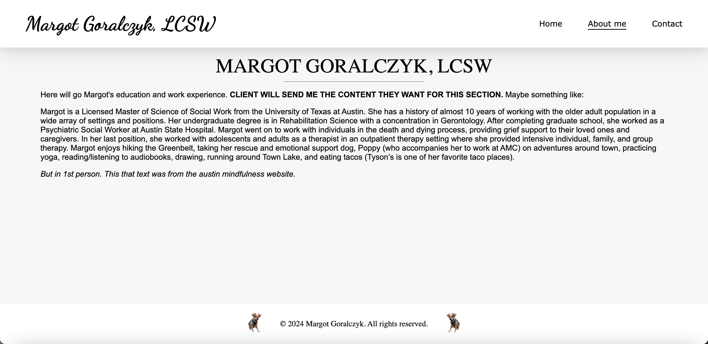
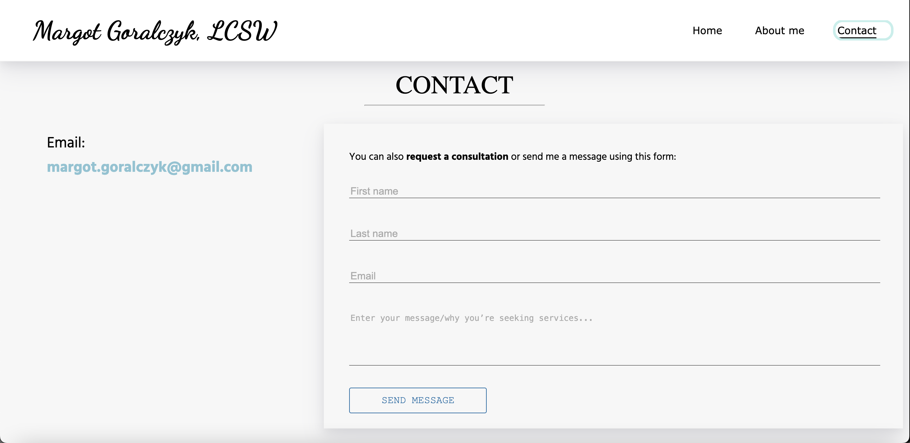

# Therapist Website

This project is a responsive website built for a therapist's practice, featuring a Home page, an About Me page, and a Contact page. It was developed using React and styled with CSS to provide a clean, professional appearance.

## Table of Contents

- [Features](#features)
- [Technologies Used](#technologies-used)
- [Installation](#installation)
- [Usage](#usage)
- [Deployment](#deployment)
- [Screenshots](#screenshots)
- [Contact](#contact)

## Features

- **Responsive Design**: The website is fully responsive and looks great on both desktop and mobile devices.
- **Navigation Bar**: A responsive navigation bar that transforms into a dropdown menu on mobile devices.
- **Contact Form**: Integrated with Email.js, allowing clients to send emails directly to the therapist.
- **CSS Styling**: Custom CSS for a polished, professional look.

## Technologies Used

- React
- Create React App
- React Router DOM 6
- Email.js
- CSS
- Git (version control)
- Vercel (deployment)

## Installation

1. Clone the repository:
   ```bash
   git clone https://github.com/pamunev/margot-therapist-website
   ```
2. Navigate to the project directory:
   ```bash
   cd margot-therapist-website
   ```
3. Install the dependencies:
   ```bash
   npm install
   ```

## Usage

1. Start the development server:
   ```bash
   npm start
   ```
2. Open your browser and go to http://localhost:3000 to view the website.

## Deployment

The website is deployed on Vercel. You can view the live site [here](https://margot-therapist-website.vercel.app/).

To deploy your own version:

1. Push your changes to GitHub.
2. Connect your GitHub repository to Vercel.
3. Follow the instructions on Vercel to deploy the site.

## Screenshots

### Home Page


### About Me Page



### Contact Page



## Contact

If you have any questions or feedback, please feel free to reach out:

- **Email**: [pamunev@gmail.com](mailto:pamunev@gmail.com)
- **GitHub**: [pamunev](https://github.com/pamunev)
